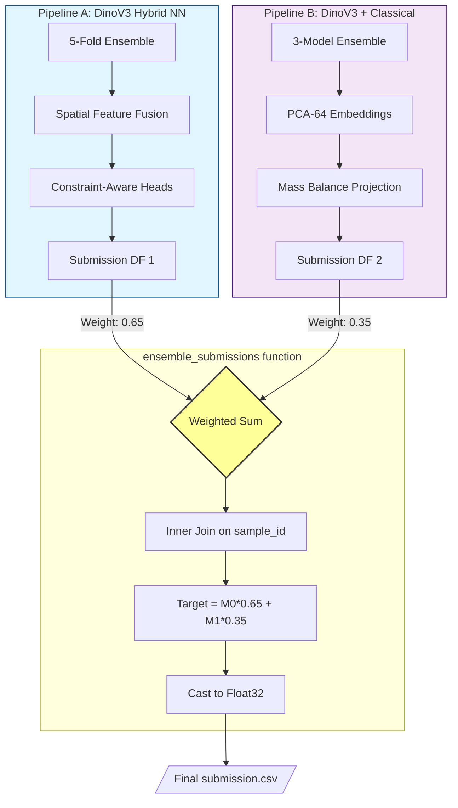
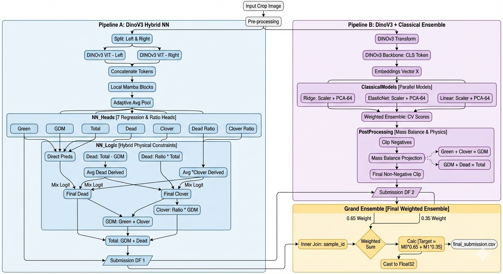

# CSIRO - Image2Biomass Prediction

#### Dinov3 + Mamba Block Neural Net

#### Dinov3 + Classical Models + Mass Balance

#### Final Ensemble

## ⚖️ Mass Balance Projection Math

We enforce physical consistency by ensuring the predicted biomass components satisfy the law of mass conservation. Given a raw prediction vector $\mathbf{x} \in \mathbb{R}^5$ in the order $[\text{Green}, \text{Clover}, \text{Dead}, \text{GDM}, \text{Total}]$, we define two linear constraints:

1. GDM Balance: $\text{Green} + \text{Clover} - \text{GDM} = 0$

2. Total Balance: $\text{Dead} + \text{GDM} - \text{Total} = 0$

This system is represented as $A\mathbf{x} = 0$, where the constraint matrix $A$ is:

$$A = \begin{bmatrix}
1 & 1 & 0 & -1 & 0 \
0 & 0 & 1 & 1 & -1
\end{bmatrix}$$

To find the corrected vector $\mathbf{x}'$ that is closest to our initial prediction $\mathbf{x}$ (minimizing the $L_2$ distance $\|\mathbf{x}' - \mathbf{x}\|^2$), we use the orthogonal projection onto the null space of $A$:

$$\mathbf{x}' = \mathbf{x} - A^T (AA^T)^{-1} (A\mathbf{x})$$

Where:

- $(A\mathbf{x})$ is the residual vector (the "error" in the physical laws).
- $(AA^T)^{-1}$ is the inverse of the constraint covariance.
- The final result $\mathbf{x}'$ is guaranteed to satisfy $A\mathbf{x}' = 0$, ensuring perfect physical alignment across all five predicted targets.

## Final Submission

- The final solution is a hierarchical ensemble combining a **Deep Learning Hybrid (DINOv3 + Mamba)** and a **Classical Feature-Based Ensemble**, both constrained by biomass physics.

-  🚀 Pipeline Breakdown
    1. **Pipeline A (Neural Network):** Uses a Stereo-split DINOv3 backbone fused with **Local Mamba Blocks** to capture spatial context. It employs a "Mix Logit" head to blend direct regression with derived ratios.
    2. **Pipeline B (Classical):** Extracts fixed DINOv3 CLS embeddings, reduces dimensionality via **PCA-64**, and ensembles Ridge, ElasticNet, and Linear models.
    3. **Mass Balance Projection:** Final predictions are projected onto a subspace that satisfies:
        - $Dry\_Green\_g + Dry\_Clover\_g = GDM\_g$
        - $GDM\_g + Dry\_Dead\_g = Dry\_Total\_g$