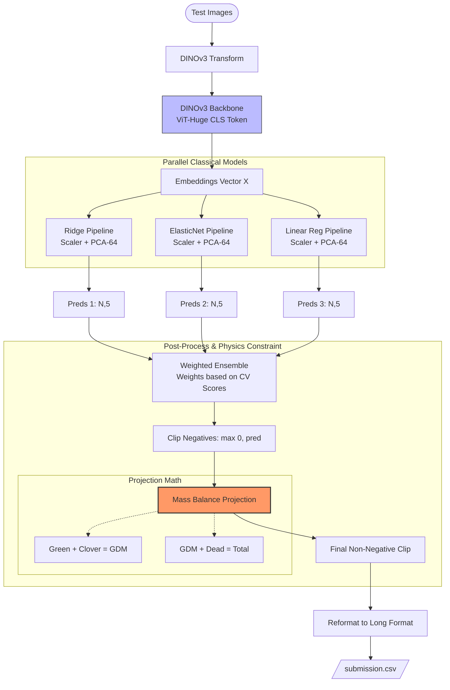
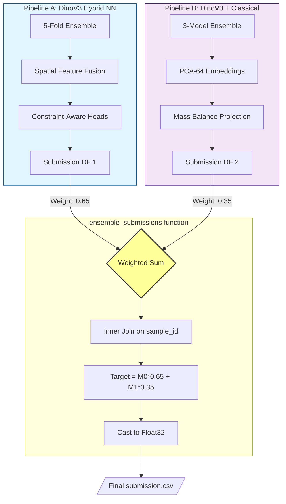
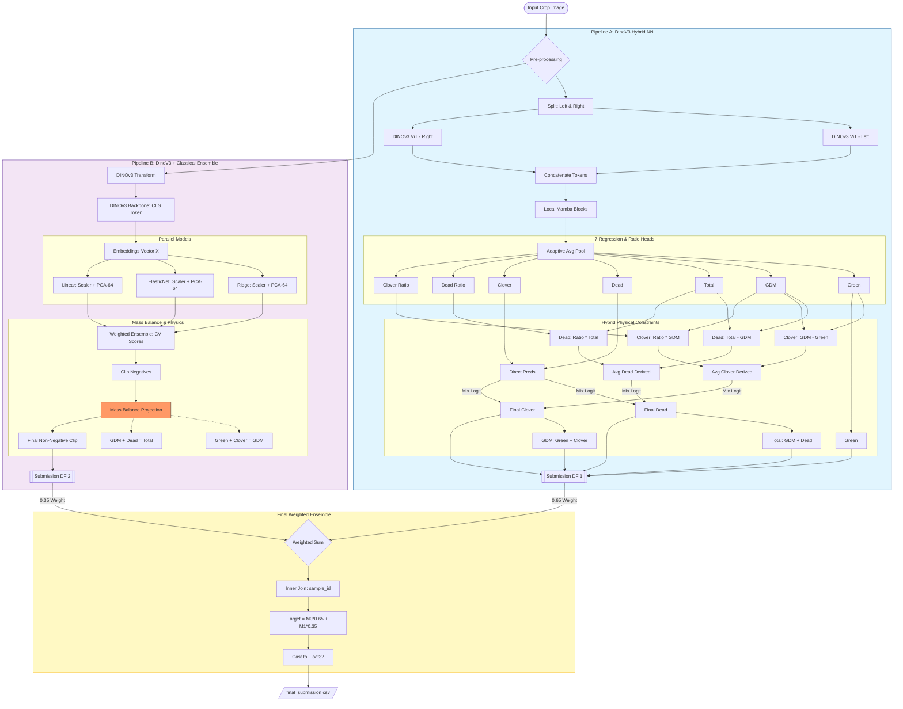

# CSIRO - Image2Biomass Prediction

#### Dinov3 + Mamba Block Neural Net

```mermaid

graph TD
    %% Input Stage
    Start([Input Full Crop Image]) --> Split[Split Image: Left & Right Halves]
    
    %% Backbone Stage
    subgraph Backbone [Feature Extraction]
    Split --> B1[DINOv3 ViT - Left]
    Split --> B2[DINOv3 ViT - Right]
    B1 --> Cat[Concatenate Tokens: 2N Tokens]
    B2 --> Cat
    end

    %% Fusion Stage
    subgraph Fusion [Sequence Processing]
    Cat --> Mamba[Local Mamba Blocks]
    Mamba --> Pool[Adaptive Avg Pool]
    end

    %% Prediction Heads
    subgraph Heads [Regression & Ratio Heads]
    Pool --> H1[Green Head]
    Pool --> H2[GDM Head]
    Pool --> H3[Total Head]
    Pool --> H4[Dead Head]
    Pool --> H5[Clover Head]
    Pool --> R1[Dead Ratio Head]
    Pool --> R2[Clover Ratio Head]
    end

    %% Logic & Mixing
    subgraph HybridLogic [Physical Constraints]
    H4 & H5 --> Direct[Direct Preds]
    
    %% Derived paths
    H3 & H2 --> D1[Derived Dead: Total - GDM]
    R1 & H3 --> D2[Derived Dead: Ratio * Total]
    H2 & H1 --> D3[Derived Clover: GDM - Green]
    R2 & H2 --> D4[Derived Clover: Ratio * GDM]
    
    D1 & D2 --> DeadAvg[Avg Dead Derived]
    D3 & D4 --> ClovAvg[Avg Clover Derived]
    
    %% Final Mix
    Direct -- Mix Logit --> FinalDead[Final Dead]
    DeadAvg -- Mix Logit --> FinalDead
    
    Direct -- Mix Logit --> FinalClov[Final Clover]
    ClovAvg -- Mix Logit --> FinalClov
    end

    %% Final Output
    H1 --> FinalGreen[Green]
    FinalClov --> FinalGDM[GDM: Green + Clover]
    FinalDead --> FinalTotal[Total: GDM + Dead]

    FinalGreen & FinalDead & FinalClov & FinalGDM & FinalTotal --> Out[/Final Pred5 Tensor/]


```

#### Dinov3 + Classical Models + Mass Balance

```mermaid

graph TD
    %% Input and Embedding
    In([Test Images]) --> Pre[DINOv3 Transform]
    Pre --> Backbone[DINOv3 Backbone<br/>ViT-Huge CLS Token]
    Backbone --> Embed[Embeddings Vector X]

    %% Classical Model Branch
    subgraph ClassicalModels [Parallel Classical Models]
        Embed --> M1[Ridge Pipeline<br/>Scaler + PCA-64]
        Embed --> M2[ElasticNet Pipeline<br/>Scaler + PCA-64]
        Embed --> M3[Linear Reg Pipeline<br/>Scaler + PCA-64]
    end

    %% Ensemble Stage
    M1 --> P1[Preds 1: N,5]
    M2 --> P2[Preds 2: N,5]
    M3 --> P3[Preds 3: N,5]
    
    P1 & P2 & P3 --> Weight[Weighted Ensemble<br/>Weights based on CV Scores]
    
    %% Post-Processing & Physics
    subgraph PostProcessing [Post-Process & Physics Constraint]
        Weight --> Clip1[Clip Negatives: max 0, pred]
        
        Clip1 --> MB[Mass Balance Projection]
        subgraph Math [Projection Math]
            MB -.-> Eq1[Green + Clover = GDM]
            MB -.-> Eq2[GDM + Dead = Total]
        end
        
        MB --> Clip2[Final Non-Negative Clip]
    end

    %% Formatting
    Clip2 --> Pivot[Reformat to Long Format]
    Pivot --> Out[/submission.csv/]

    style MB fill:#f96,stroke:#333,stroke-width:2px
    style Backbone fill:#bbf,stroke:#333


```

#### Final Ensemble

```mermaid

graph TD
    %% Source Streams
    subgraph NN_Branch [Pipeline A: DinoV3 Hybrid NN]
        N1[5-Fold Ensemble] --> N2[Spatial Feature Fusion]
        N2 --> N3[Constraint-Aware Heads]
        N3 --> SUB_A[Submission DF 1]
    end

    subgraph Classical_Branch [Pipeline B: DinoV3 + Classical]
        C1[3-Model Ensemble] --> C2[PCA-64 Embeddings]
        C2 --> C3[Mass Balance Projection]
        C3 --> SUB_B[Submission DF 2]
    end

    %% The Weighted Merge
    SUB_A -- "Weight: 0.65" --> Merge{Weighted Sum}
    SUB_B -- "Weight: 0.35" --> Merge

    %% Processing Logic
    subgraph EnsembleLogic [ensemble_submissions function]
        Merge --> Align[Inner Join on sample_id]
        Align --> Calc[Target = M0*0.65 + M1*0.35]
        Calc --> Float32[Cast to Float32]
    end

    %% Final
    Float32 --> FinalOut[/Final submission.csv/]

    style Merge fill:#ff9,stroke:#333,stroke-width:2px
    style NN_Branch fill:#e1f5fe,stroke:#01579b
    style Classical_Branch fill:#f3e5f5,stroke:#4a148c

```

## Final Submission

```mermaid

graph TD
    %% Global Input
    Start([Input Crop Image]) --> PreProc{Pre-processing}

    %% PIPELINE A: NN BRANCH
    subgraph Pipeline_A [Pipeline A: DinoV3 Hybrid NN]
        PreProc --> Split[Split: Left & Right]
        Split --> B1[DINOv3 ViT - Left]
        Split --> B2[DINOv3 ViT - Right]
        B1 & B2 --> Cat[Concatenate Tokens]
        Cat --> Mamba[Local Mamba Blocks]
        Mamba --> Pool[Adaptive Avg Pool]
        
        subgraph NN_Heads [7 Regression & Ratio Heads]
            Pool --> H1[Green]
            Pool --> H2[GDM]
            Pool --> H3[Total]
            Pool --> H4[Dead]
            Pool --> H5[Clover]
            Pool --> R1[Dead Ratio]
            Pool --> R2[Clover Ratio]
        end

        subgraph NN_Logic [Hybrid Physical Constraints]
            H4 & H5 --> Direct[Direct Preds]
            H3 & H2 --> D1[Dead: Total - GDM]
            R1 & H3 --> D2[Dead: Ratio * Total]
            H2 & H1 --> D3[Clover: GDM - Green]
            R2 & H2 --> D4[Clover: Ratio * GDM]
            
            D1 & D2 --> DeadAvg[Avg Dead Derived]
            D3 & D4 --> ClovAvg[Avg Clover Derived]
            
            Direct -- Mix Logit --> FinalDead[Final Dead]
            DeadAvg -- Mix Logit --> FinalDead
            Direct -- Mix Logit --> FinalClov[Final Clover]
            ClovAvg -- Mix Logit --> FinalClov
            
            FinalClov --> FinalGDM_A[GDM: Green + Clover]
            FinalDead --> FinalTotal_A[Total: GDM + Dead]
            H1 --> FinalGreen_A[Green]
        end
        
        FinalGreen_A & FinalDead & FinalClov & FinalGDM_A & FinalTotal_A --> SUB_A[[Submission DF 1]]
    end

    %% PIPELINE B: CLASSICAL BRANCH
    subgraph Pipeline_B [Pipeline B: DinoV3 + Classical Ensemble]
        PreProc --> DTransform[DINOv3 Transform]
        DTransform --> DBackbone[DINOv3 Backbone: CLS Token]
        DBackbone --> Embed[Embeddings Vector X]
        
        subgraph ClassicalModels [Parallel Models]
            Embed --> M1[Ridge: Scaler + PCA-64]
            Embed --> M2[ElasticNet: Scaler + PCA-64]
            Embed --> M3[Linear: Scaler + PCA-64]
        end
        
        M1 & M2 & M3 --> Weight[Weighted Ensemble: CV Scores]
        
        subgraph PostProcessing [Mass Balance & Physics]
            Weight --> Clip1[Clip Negatives]
            Clip1 --> MB[Mass Balance Projection]
            MB -.-> Eq1[Green + Clover = GDM]
            MB -.-> Eq2[GDM + Dead = Total]
            MB --> Clip2[Final Non-Negative Clip]
        end
        
        Clip2 --> SUB_B[[Submission DF 2]]
    end

    %% FINAL ENSEMBLE
    subgraph GrandEnsemble [Final Weighted Ensemble]
        SUB_A -- "0.65 Weight" --> Merge{Weighted Sum}
        SUB_B -- "0.35 Weight" --> Merge
        
        Merge --> Align[Inner Join: sample_id]
        Align --> Calc[Target = M0*0.65 + M1*0.35]
        Calc --> Float32[Cast to Float32]
    end

    Float32 --> FinalOut[/final_submission.csv/]

    %% Styling
    style GrandEnsemble fill:#fff9c4,stroke:#fbc02d
    style Pipeline_A fill:#e1f5fe,stroke:#01579b
    style Pipeline_B fill:#f3e5f5,stroke:#4a148c
    style MB fill:#f96,stroke:#333


```