# CSIRO - Image2Biomass Prediction


## Problem Statement

- Build models that predict pasture biomass from images, ground-truth measurements, and publicly available datasets. Farmers will use these models to determine when and how to graze their livestock.

- You can checkout the competition using this [link](https://www.kaggle.com/competitions/csiro-biomass)

## 📊 Evaluation Logic

The model performance is evaluated using a **globally weighted coefficient of determination ($R^2_w$)** computed across all (image, target) pairs simultaneously. Unlike a standard macro-average, this metric applies specific importance weights to each target type before calculating a single unified score.

### ⚖️ Target Weighting Schema
Each prediction row is weighted according to its target type using the following distribution:

| Target Name | Weight ($w_j$) |
| :--- | :--- |
| **Dry_Green_g** | 0.1 |
| **Dry_Dead_g** | 0.1 |
| **Dry_Clover_g** | 0.1 |
| **GDM_g** | 0.2 |
| **Dry_Total_g** | 0.5 |

> **Note:** A single weighted $R^2$ is computed by combining all target rows rather than averaging separate $R^2$ scores per target.

---

### 📉 Evaluation Metric: Weighted $R^2$

The **Weighted Coefficient of Determination ($R^2_w$)** accounts for the varying importance of different biomass components.

#### **Mathematical Definition**
The final score is calculated as:

$$R^2_w = 1 - \frac{\sum_{j} w_j (y_j - \hat{y}_j)^2}{\sum_{j} w_j (y_j - \bar{y}_w)^2}$$

Where the **global weighted mean** $\bar{y}_w$ is defined as:

$$\bar{y}_w = \frac{\sum_{j} w_j y_j}{\sum_{j} w_j}$$

#### **Metric Breakdown**
* **Residual Sum of Squares ($SS_{\text{res}}$):** Measures the total weighted error of the model's predictions.
  $$SS_{\text{res}} = \sum_{j} w_j (y_j - \hat{y}_j)^2$$
* **Total Sum of Squares ($SS_{\text{tot}}$):** Measures the total weighted variance in the ground-truth data.
  $$SS_{\text{tot}} = \sum_{j} w_j (y_j - \bar{y}_w)^2$$

#### **Terms Definition**
| Term | Description |
| :--- | :--- |
| $y_j$ | Ground-truth value for data point $j$ |
| $\hat{y}_j$ | Model prediction for data point $j$ |
| $w_j$ | Per-row weight based on target type (see table above) |
| $\bar{y}_w$ | Global weighted mean of all ground-truth values |


## Training

#### Split strategy

- `Wide-Format Conversion:` The raw long-format data is pivoted to a wide format, ensuring each image_id has a single row containing all five biomass targets: Green, Dead, Clover, GDM, and Total.

- `Metadata Extraction:` Unique image identifiers are generated from file paths, and essential environmental features (State, Sampling Date, Species) are preserved for grouping.

- `Log-Scaled Total Biomass:` To handle the skewed distribution of crop yields, the "Total" target is log-transformed before binning, which helps create more representative quantiles.

- `Vegetation Composition Ratios:` A "Green-to-Total" ratio is calculated to capture the physiological characteristics of the sample, ensuring the model sees a mix of dry and lush crops in every fold.

- `Compact Strata Generation:` Total biomass (6 bins) and Green ratio (4 bins) are combined to create up to 60 unique strata codes, allowing for highly granular balancing across folds.


- `Environmental Grouping: `A composite env_group is created by joining State and Sampling_Date. This ensures all images from a specific location and time stay together in either training or validation, preventing the model from "cheating" via spatial-temporal correlation.

- `Stratified Group K-Fold (SGKF):` The splitting algorithm uses these environmental groups while simultaneously balancing the biomass strata across all 5 folds.


- `Fold-Specific Exports:` The logic automatically generates 10 separate CSV files (5 training/5 validation pairs) ready for immediate use by the train.py script.

- `Validation Integrity:` By holding out Fold 4 specifically for your current training run, you maintain a robust local leaderboard that should correlate well with the competition leaderboard.


#### Training flow

```mermaid


graph TD
    %% Setup Phase
    Start([CLI Command Execution]) --> Init[Initialize Args, Seeds, & MLflow]
    Init --> FoldCheck{Fold CSVs Exist?}
    FoldCheck -- No --> MakeFolds[data_split.make_folds: 5-Fold Stratified Split]
    FoldCheck -- Yes --> LoadFold[Load Fold 4 CSVs]
    
    %% Data Pipeline
    subgraph Data_Prep [Data Loading & Augmentation]
        LoadFold --> DS[CSIRODataset]
        DS --> Aug[Albumentations: Resize 1024x2048, H/V Flip, RandomShadow, GaussianBlur, Normalize]
        Aug --> DL[DataLoader: Batch Size 4]
    end

    %% Model & Optimization Setup
    subgraph Model_Setup [Architecture & Optimization]
        DL --> ModelBuild[DinoV3Hybrid: ViT-Huge + Mamba Fusion]
        ModelBuild --> Opt[AdamW Optimizer]
        ModelBuild --> Sch[Cosine Annealing Scheduler + 3 Epoch Warmup]
        ModelBuild --> AMP[GradScaler: Mixed Precision Training]
    end

    %% Training Loop
    subgraph Training_Epoch [Epoch Loop: 1 to 50]
        AMP --> TrainStep[Train One Epoch]
        
        subgraph Hybrid_Forward [DinoV3Hybrid Forward Pass]
            TrainStep --> TileSplit[Split Image: Left & Right Tiles]
            TileSplit --> ViT[Parallel ViT-Huge Backbones]
            ViT --> Fusion[Token Concatenation + Mamba Local Fusion]
            Fusion --> Heads[7 Heads: Green, GDM, Total, Dead, Clover, Dead-Ratio, Clover-Ratio]
        end
        
        Hybrid_Forward --> LossCalc[Hybrid Loss Calculation]
        
        subgraph Loss_Components [Multi-Objective Loss]
            LossCalc --> L1[Weighted RMSE: Pred5 vs GT5]
            LossCalc --> L2[Huber Loss: Predicted Ratios vs GT Ratios]
            LossCalc --> L3[Non-Negativity Constraints]
            LossCalc --> L4[Alignment Loss: Direct vs Derived Heads]
        end
    end

    %% Validation & Logging
    Training_Epoch --> ValStep[Val One Epoch: Calculate Weighted R² Score]
    ValStep --> Checkpoint{Is Best Score?}
    Checkpoint -- Yes --> Save[Save .pt Checkpoint & Log MLflow Artifact]
    Checkpoint -- No --> Log[Log Metrics to MLflow]
    
    Log --> Next{Epoch < 50?}
    Next -- Yes --> Training_Epoch
    Next -- No --> End([Training Complete])

    %% Styling
    style Hybrid_Forward fill:#e1f5fe,stroke:#01579b
    style Loss_Components fill:#fff3e0,stroke:#e65100
    style Model_Setup fill:#f3e5f5,stroke:#4a148c


```



#### Command to run the train.py script

```

python scripts/train.py --repo-root . --img-dir . --train-csv train.csv --splits-dir exps/splits/csiro_folds_5 --n-splits 5  --select-fold 4 --epochs 50 --batch-size 4 --lr 3e-4 --lr-scheduler cosine --warmup-epochs 3 --img-size 512 --shadow-p 0.5 --pin-memory --model-name DinoV3Hybrid --model-id vit_huge_plus_patch16_dinov3.lvd1689m

```

## Pipeline

#### Dinov3 + Mamba Block Neural Net


#### Dinov3 + Classical Models + Mass Balance


#### Final Ensemble


## ⚖️ Mass Balance Projection Math

We enforce physical consistency by ensuring the predicted biomass components satisfy the law of mass conservation. Given a raw prediction vector $\mathbf{x} \in \mathbb{R}^5$ in the order $[\text{Green}, \text{Clover}, \text{Dead}, \text{GDM}, \text{Total}]$, we define two linear constraints:


1. GDM Balance: $\text{Green} + \text{Clover} - \text{GDM} = 0$

2. Total Balance: $\text{Dead} + \text{GDM} - \text{Total} = 0$


This system is represented as $A\mathbf{x} = 0$, where the constraint matrix $A$ is:

$$A = \begin{bmatrix}
1 & 1 & 0 & -1 & 0 \
0 & 0 & 1 & 1 & -1
\end{bmatrix}$$


To find the corrected vector $\mathbf{x}'$ that is closest to our initial prediction $\mathbf{x}$ (minimizing the $L_2$ distance $\|\mathbf{x}' - \mathbf{x}\|^2$), we use the orthogonal projection onto the null space of $A$:


$$\mathbf{x}' = \mathbf{x} - A^T (AA^T)^{-1} (A\mathbf{x})$$

Where:

- $(A\mathbf{x})$ is the residual vector (the "error" in the physical laws).
- $(AA^T)^{-1}$ is the inverse of the constraint covariance.
- The final result $\mathbf{x}'$ is guaranteed to satisfy $A\mathbf{x}' = 0$, ensuring perfect physical alignment across all five predicted targets.


## Final Submission

- The final solution is a hierarchical ensemble combining a **Deep Learning Hybrid (DINOv3 + Mamba)** and a **Classical Feature-Based Ensemble**, both constrained by biomass physics.


-  🚀 Pipeline Breakdown
    1. **Pipeline A (Neural Network):** Uses a Stereo-split DINOv3 backbone fused with **Local Mamba Blocks** to capture spatial context. It employs a "Mix Logit" head to blend direct regression with derived ratios.
    2. **Pipeline B (Classical):** Extracts fixed DINOv3 CLS embeddings, reduces dimensionality via **PCA-64**, and ensembles Ridge, ElasticNet, and Linear models.
    3. **Mass Balance Projection:** Final predictions are projected onto a subspace that satisfies:
        - $DryGreen\_g + DryClover\_g = GDM\_g$
        - $GDM\_g + DryDead\_g = DryTotal\_g$